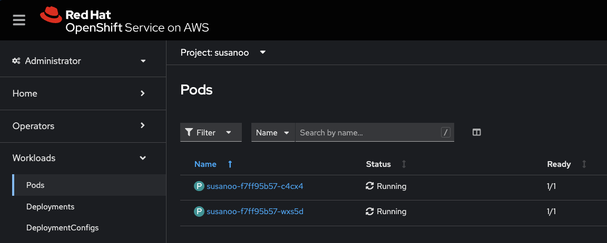
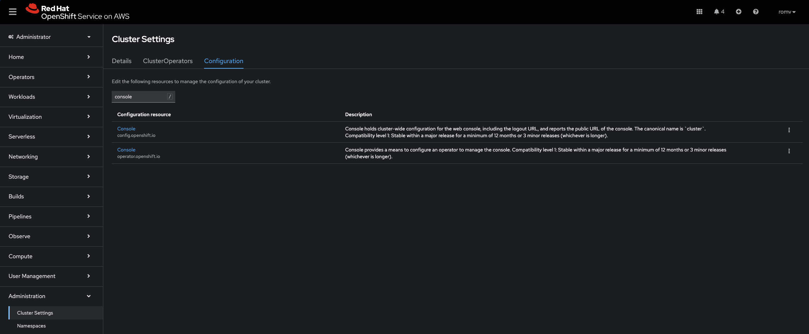
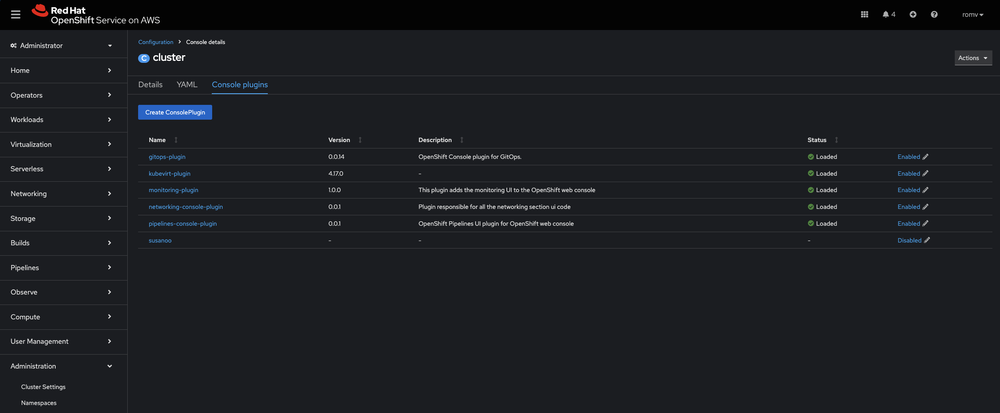
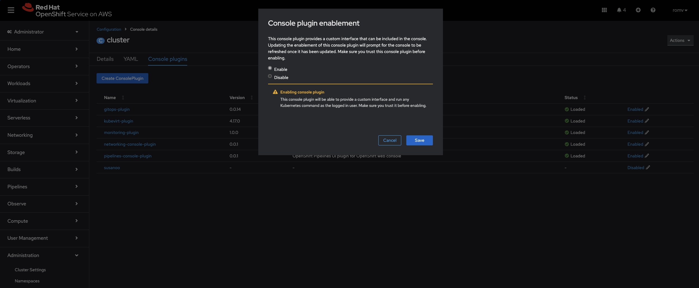
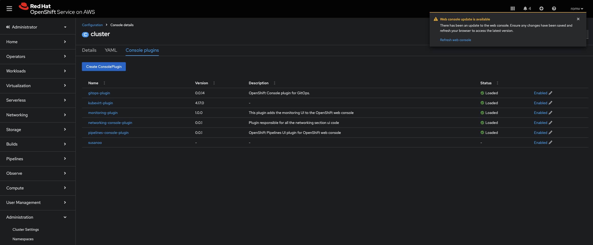
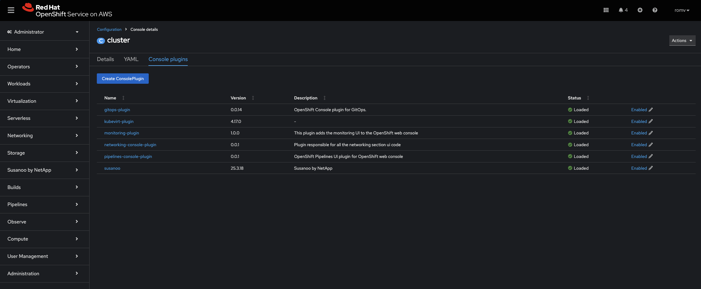

# netapp-openshift-console-protect

This project is currently in a pre-release phase and requires an Early Access Program agreement granting a read-only access token to deploy the netapp-openshift-console-protect plugin on your Red Hat OpenShift cluster. 

Reach out to the NetApp Innovation Labs team to know more.

## Deployment with Helm

The provided Helm Charts allows you to deploy easily netapp-openshift-console-protect to any Red Hat OpenShift Cluster that your terminal console is connected to. 

* Clone this repository
  ```
  git clone https://github.com/NetApp/netapp-openshift-console-protect
  ```

* Then, when in the ```netapp-openshift-console-protect``` folder, run:
  ```
  helm install netapp-openshift-console-protect . -n netapp-openshift-console-protect --create-namespace --set plugin.image=ghcr.io/netapp/netapp-openshift-console-protect:25.6.25 --set plugin.imageCredentials.registry=ghcr.io --set plugin.imageCredentials.username=<username> --set plugin.imageCredentials.token=<token> 
  ```
  Expected output:
  ```
  Release "netapp-openshift-console-protect" does not exist. Installing it now.
  NAME: netapp-openshift-console-protect
  LAST DEPLOYED: Wed Jun 11 11:38:31 2025
  NAMESPACE: netapp-openshift-console-protect
  STATUS: deployed
  REVISION: 1
  TEST SUITE: None
  ```

> [!NOTE]
> While the access Token is **read only**, it is a good practice to ***not be saved*** these files in a Git repository as it contains credentials.


  The only variable is ```plugin.image=ghcr.io/netapp/netapp-openshift-console-protect:25.6.25``` corresponding to the desired version to deploy. At the current stage, the following version(s) are available:  
  - 25.6.25

* Verify the status of the netapp-openshift-console-protect's Pods:
  ```
  oc get pods -n netapp-openshift-console-protect
  ```
  Expected output:
  ```
  NAME                      READY   STATUS    RESTARTS   AGE
  netapp-openshift-console-protect-f7ff95b57-c4cx4   1/1     Running   0          24h
  netapp-openshift-console-protect-f7ff95b57-wxs5d   1/1     Running   0          24h  
  ```

  This can also be verified via the console by selecting ```Workloads```, ```Pods```, and the Project ```netapp-openshift-console-protect```:
  

## Enable netapp-openshift-console-protect in Red Hat OpenShift

This can also be done via the console by:
* selecting ```Administration```, ```Cluster Settings```, then the tab ```Configuration```:

* clicking on ```Console``` with the mention ```operator.openshift.io```, then the tab ```Console plugins```:

* clicking on ```Disable```, select ```Enable```, then click ```Save```:

* waiting for about a minute, a message will appear welcoming you to refresh the console, click ```Refresh console```:

* At this stage, the version and description should appear as well as the menu ```netapp-openshift-console-protect by NetApp``` between ```Storage``` and ```Builds```.


## Uninstall netapp-openshift-console-protect 

If deployed with Helm, then runn the following command:
```
helm uninstall netapp-openshift-console-protect -n netapp-openshift-console-protect
```
Expected output:
```
release "netapp-openshift-console-protect" uninstalled
```